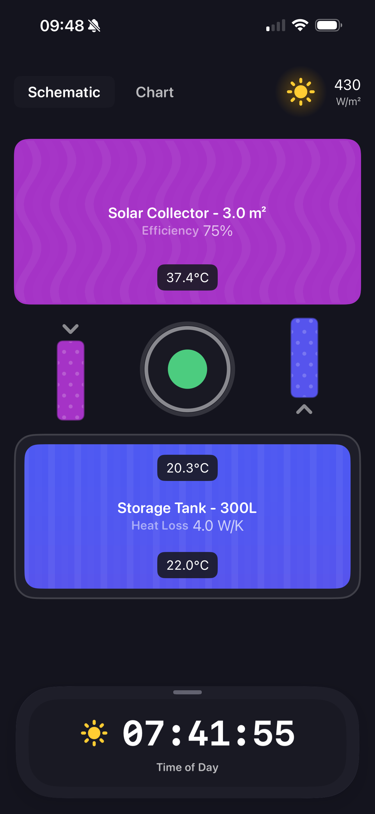
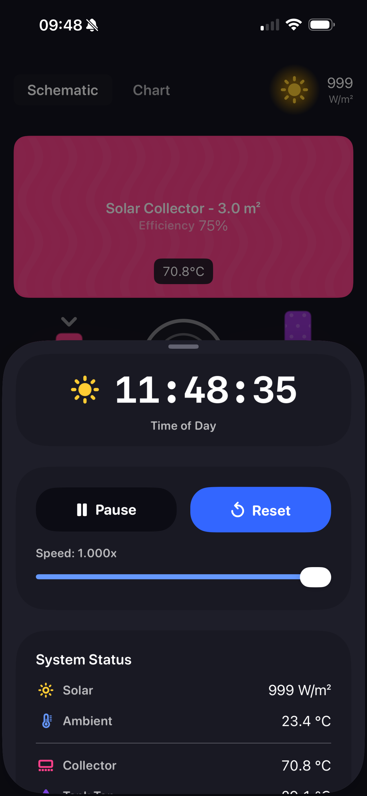
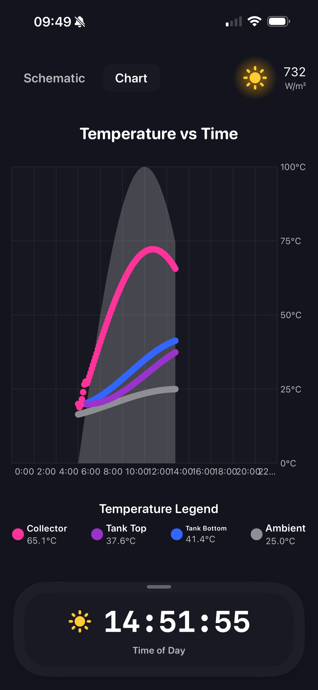
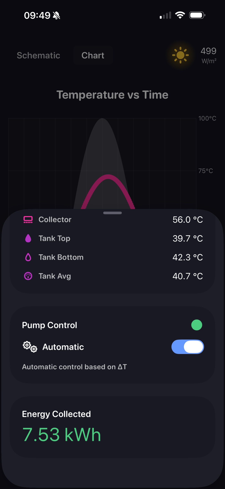

# Solar Thermal System Simulation

<div align="center">


A comprehensive iPhone/iPad app simulating a solar thermal heating system with real-time physics-based heat transfer calculations and interactive visualization.

[Features](#-features) • [Quick Start](#-quick-start) • [Architecture](#-architecture) • [Documentation](#-documentation)

</div>

<p align="center">
  
  
  
  
</p>

---

## 📑 Table of Contents

- [Overview](#-overview)
- [Features](#-features)
- [Quick Start](#-quick-start)
- [Installation](#-installation)
- [Usage Guide](#-usage-guide)
- [Architecture](#-architecture)
- [Physics Model](#-physics-model)
- [User Interface](#-user-interface)
- [Technical Details](#-technical-details)
- [Development](#-development)
- [Documentation](#-documentation)
- [Educational Value](#-educational-value)
- [Future Enhancements](#-future-enhancements)
- [References](#-references)
- [License](#-license)

---

## 🎯 Overview

This educational simulation demonstrates how solar thermal systems work by modeling heat transfer from a solar collector panel to a stratified storage tank. The app provides real-time visualization of temperatures, pump control, and energy collection over a simulated 24-hour day/night cycle.

**Key Highlights:**
- ⚡ Real-time physics-based simulation
- 📊 Interactive temperature charts
- 🎨 Beautiful schematic visualization
- 🔄 Automatic pump control with hysteresis
- 🌡️ Multi-layer thermal stratification
- ⏱️ Variable simulation speed (1x - 1000x)

---

## ✨ Features

### Core Functionality

- **Real-time Simulation**: Physics-based heat transfer calculations updated continuously at 10 Hz
- **24-Hour Solar Cycle**: Realistic day/night irradiance patterns with dawn, noon peak, and dusk
- **Thermal Stratification**: Multi-layer tank model (10 layers) preserving hot water at top, cold at bottom
- **Automatic Pump Control**: Differential temperature controller with hysteresis to prevent rapid cycling
- **Interactive Charts**: Live temperature graphs using SwiftUI Charts framework
- **Variable Speed**: Adjust simulation speed from 1x to 1000x real-time
- **Manual Control Mode**: Override automatic pump control for experimentation

### Visualization

- **Schematic View**: Animated system diagram showing collector, pipes, and storage tank
- **Temperature Chart**: Multi-series graph tracking all system temperatures over time
- **Temperature Tracking**: 
  - Solar collector temperature
  - Tank top and bottom temperatures  
  - Ambient air temperature
  - Solar irradiance (scaled for visibility)
- **System Status**:
  - Real-time clock display (00:00 - 23:59)
  - Pump on/off indicator with haptic feedback
  - Cumulative energy collected (kWh)
  - Color-coded temperature indicators
- **Responsive Layout**: 
  - Landscape: Side-by-side control panel and visualization
  - Portrait: Stacked layout optimized for iPad

### User Experience

- **Dark Mode**: Beautiful dark theme optimized for visualization
- **Haptic Feedback**: Tactile responses for pump state changes
- **Smooth Animations**: Fluid transitions and animated system components
- **Responsive Design**: Adapts to different iPad sizes and orientations

---

## 🚀 Quick Start

### Prerequisites

- **iOS SDK**: 18.0 or later
- **Device**: iPhone or iPad running iOS 18.0+

### Installation

1. **Clone the repository**
   ```bash
   git clone <repository-url>
   cd SolarThermalSystem
   ```

2. **Open in Xcode**
   ```bash
   open SolarThermalSystem.xcodeproj
   ```

3. **Select target device**
   - Choose an iPad Simulator (recommended: iPad Pro 12.9-inch)
   - Or connect a physical iPad device

4. **Build and Run**
   - Press `⌘R` or click the Run button
   - Wait for the app to build and launch

5. **Start simulating**
   - Tap the green **Start** button
   - Watch the simulation begin at 6:00 AM (sunrise)

> 📖 For detailed usage instructions, see [QUICKSTART.md](QUICKSTART.md)

---

## 💻 Usage Guide

### Basic Operation

1. **Start Simulation**: Tap the green "Start" button to begin the 24-hour simulation
2. **Watch Temperature Rise**: As sun comes up, collector heats and pump automatically turns on
3. **Observe Stratification**: Tank bottom heats first, then heat rises to top layers
4. **Adjust Speed**: Use slider to speed up simulation (60x = 1 real second = 1 simulated minute)
5. **Monitor Energy**: Track cumulative kWh collected throughout the day

### Controls

- **Start/Pause Button**: Toggle simulation running state
- **Reset Button**: Return to initial conditions (6:00 AM, all temps at 20°C)
- **Speed Slider**: Adjust simulation speed (1x - 1000x)
- **Automatic Control Toggle**: Switch between automatic and manual pump control
- **Manual Pump Toggle**: Turn pump on/off manually (only when automatic control is disabled)

### View Modes

- **Schematic View**: Visual representation of the system with animated components
- **Chart View**: Detailed temperature graphs with multiple data series

### Understanding the Graph

The interactive chart shows five data series:

1. **Orange Line** (Collector Temp): Rises quickly in sun, cools at night
2. **Red Line** (Tank Top): Hottest part of tank, heats gradually
3. **Blue Line** (Tank Bottom): Cooler inlet, heats when pump runs
4. **Gray Dashed** (Ambient): Background air temperature
5. **Yellow Dashed** (Solar ÷10): Irradiance scaled down for visibility

### Temperature Colors

Temperature indicators use a color-coded system:

- **Blue** (< 20°C): Cold
- **Cyan** (20-30°C): Cool
- **Green** (30-40°C): Warm
- **Yellow** (40-50°C): Hot
- **Orange** (50-60°C): Very Hot
- **Red** (> 60°C): Extremely Hot

---

## 🏗️ Architecture

The app follows **MVVM (Model-View-ViewModel)** architecture with clean separation of concerns and feature-based organization.

### Directory Structure

```
SolarThermalSystem/
├── App/                                    # Application Layer
│   └── SolarThermalSystemApp.swift        # App entry point
│
├── Core/                                   # Core/Reusable Layer
│   ├── Styling/                           # Styling & Theming
│   │   └── AppStyling.swift              # Centralized design system
│   └── UI/                                # Reusable UI Components
│       ├── FloatingPanel.swift           # Floating panel modifier
│       └── HapticsManager.swift          # Haptic feedback manager
│
├── Features/                               # Features Layer
│   └── Simulation/                        # Simulation Feature
│       ├── Models/                        # Domain/Business Models
│       │   ├── EnvironmentalConditions.swift
│       │   ├── SolarCollector.swift
│       │   ├── ThermalStorageTank.swift
│       │   ├── Pump.swift
│       │   └── TemperatureDataPoint.swift
│       ├── ViewModels/                    # Presentation Logic
│       │   └── SimulationViewModel.swift
│       └── Views/                         # UI Views
│           ├── DashboardView.swift
│           ├── SchematicView.swift
│           └── TemperatureChartView.swift
│
└── Resources/                              # Resources Layer
    └── Assets.xcassets/                   # Images, colors, icons
```

### Design Principles

1. **Separation of Concerns**: Each physical component is a separate class/struct
2. **Pure Logic Models**: Models contain no SwiftUI dependencies
3. **Observable State**: ViewModel publishes changes via `@Published` properties
4. **Responsive UI**: SwiftUI automatically updates views when state changes
5. **Feature-Based Organization**: Code organized by feature domain

### MVVM Pattern

- **Models** (`Models/`): Pure business logic with no UI dependencies
  - `EnvironmentalConditions`: Solar irradiance and ambient temperature calculations
  - `SolarCollector`: Heat absorption and transfer physics
  - `ThermalStorageTank`: Thermal storage with 10-layer stratification
  - `Pump`: Circulation pump control logic

- **ViewModels** (`ViewModels/`): Bridge between Models and Views
  - `SimulationViewModel`: Orchestrates the simulation, updates UI state

- **Views** (`Views/`): SwiftUI views for presentation
  - `DashboardView`: Main interface with control panel and view navigation
  - `SchematicView`: Visual schematic of the system
  - `TemperatureChartView`: Interactive temperature charts

> 📖 For detailed architecture documentation, see [ARCHITECTURE.md](ARCHITECTURE.md)

---

## 🔬 Physics Model

### Solar Collector

The collector absorbs sunlight and converts it to heat with realistic losses:

```
Q_solar = G(t) × A × η
Q_loss = U_loss × A × (T_panel - T_ambient)
```

**Where:**
- `G(t)` = Solar irradiance (0-1000 W/m²), varies with time of day
- `A` = Collector area (3.0 m²)
- `η` = Efficiency (75%)
- `U_loss` = Heat loss coefficient (8.0 W/m²·K)

**Heat Transfer to Tank:**
- Only occurs when pump is ON and `T_collector > T_tank_bottom`
- Rate limited to prevent unrealistic temperature swings
- Uses heat transfer coefficient: 150 W/K

### Thermal Storage Tank

The tank uses **10 stratification layers** to model natural convection:

- **Heat Input**: Bottom layer receives heat from collector when pump is on
- **Stratification**: Hot water naturally rises, maintaining temperature gradient
- **Heat Losses**: Each layer loses heat to ambient, top layer loses more
- **Mixing**: Limited thermal diffusion between layers preserves stratification

**Benefits of stratification:**
- Hottest water stays at top for immediate use
- Cooler bottom water more efficiently absorbs collector heat
- More realistic than single-temperature tank models

**Tank Properties:**
- Volume: 300 liters
- Number of layers: 10
- Water specific heat: 4184 J/kg·K
- Heat loss coefficient: 2.0 W/K

### Pump Control

Automatic differential controller with hysteresis:

- **Turn ON**: When `T_collector - T_tank_bottom > 10°C`
- **Turn OFF**: When `T_collector - T_tank_bottom < 3°C`

This prevents rapid on/off cycling and ensures efficient heat transfer only when beneficial.

### Environment

24-hour cycle with realistic patterns:

- **Solar Irradiance**: Sine curve from sunrise (6 AM) to sunset (6 PM), peaking at noon (~1000 W/m²)
- **Ambient Temperature**: Cosine wave with minimum at 3 AM (15°C) and maximum at 3 PM (25°C)

### Thermodynamic Correctness

The simulation follows fundamental thermodynamic principles:

1. **Energy Conservation**: All heat flows are accounted for (solar input = stored energy + losses)
2. **Second Law**: Heat flows from hot to cold (collector to tank only when T_collector > T_tank)
3. **Natural Convection**: Hot water rises in tank, maintaining stratification
4. **Realistic Limits**: Temperatures bounded by physics (no negative temps, stagnation at equilibrium)

> 📖 For detailed thermodynamic evaluation, see [THERMODYNAMIC_EVALUATION.md](THERMODYNAMIC_EVALUATION.md)

---

## 🎨 User Interface

### Dashboard View

The main interface consists of:

- **Control Panel**: System controls and status indicators
- **Visualization Area**: Schematic or chart view (switchable)
- **Floating Panel**: Collapsible control panel (portrait mode)

### Schematic View

Visual representation of the system showing:

- **Solar Collector**: Top panel with heat visualization
- **Piping System**: Animated flow when pump is active
- **Storage Tank**: Multi-layer visualization with temperature gradient
- **Temperature Indicators**: Color-coded temperature display
- **System Labels**: Clear component identification

### Chart View

Interactive temperature charts featuring:

- **Multiple Series**: Collector, tank top, tank bottom, ambient, irradiance
- **Time Axis**: 24-hour simulation timeline
- **Interactive Zoom**: Pinch to zoom (if supported)
- **Smooth Animation**: Automatic updates as simulation progresses
- **Legend**: Clear identification of each data series

### Responsive Design

The interface adapts to different device sizes and orientations:

- **iPad Landscape**: Side-by-side layout with control panel on left
- **iPad Portrait**: Stacked layout with floating control panel
- **iPhone Landscape**: Side-by-side layout (compact)
- **iPhone Portrait**: Full-screen stacked layout

> 📖 For UI design details, see [UI_DESIGN.md](UI_DESIGN.md)

---

## ⚙️ Technical Details

### Simulation Parameters

```swift
// Time stepping
simulationTimeStep = 60.0 seconds     // 1-minute increments
updateInterval = 0.1 seconds          // 10 Hz UI refresh

// Collector
area = 3.0 m²
efficiency = 0.75 (75%)
heatLossCoefficient = 8.0 W/m²·K
thermalCapacity = 15000 J/K
pumpHeatTransferCoefficient = 150 W/K

// Tank
volume = 300 liters
numberOfLayers = 10
waterSpecificHeat = 4184 J/kg·K
heatLossCoefficient = 2.0 W/K

// Pump
turnOnDelta = 10°C
turnOffDelta = 3°C
heatTransferCoefficient = 500 W/K (implicit in model)
```

### Performance

- **Real-time Updates**: 10 Hz UI refresh for smooth visualization
- **Efficient Calculations**: Simple explicit Euler integration for heat equations
- **Memory Management**: Data points limited to 500 to prevent memory growth
- **Smooth Charts**: SwiftUI Charts automatically animates data updates
- **Optimized Rendering**: Efficient SwiftUI views with minimal redraws

### Dependencies

- **SwiftUI**: Native iOS UI framework
- **Charts**: SwiftUI Charts framework for temperature visualization
- **Combine**: Reactive programming for state management
- **Foundation**: Core Swift functionality

### System Requirements

- **iOS**: 18.0 or later
- **iPadOS**: 18.0 or later
- **Swift**: 5.9 or later

---

## 🛠️ Development

### Building the Project

1. **Open Xcode**
   ```bash
   open SolarThermalSystem.xcodeproj
   ```

2. **Select Scheme**
   - Choose "SolarThermalSystem" scheme
   - Select iPad Simulator or device

3. **Build**
   - Press `⌘B` to build
   - Fix any build errors

4. **Run Tests**
   - Press `⌘U` to run unit tests
   - Check test results in Test Navigator

### Project Structure

The project uses Xcode's modern `PBXFileSystemSynchronizedRootGroup` format, which automatically discovers source files. No manual project file updates are needed when adding or moving files.

### Code Style

- **Swift Style Guide**: Follow Swift API Design Guidelines
- **Naming**: Use descriptive names, prefer clarity over brevity
- **Documentation**: Use Swift doc comments for public APIs
- **Organization**: Keep related code together, use extensions for organization

### Adding New Features

1. Create a new folder under `Features/` (if needed)
2. Add subfolders: `Models/`, `ViewModels/`, `Views/`
3. Keep feature-specific code within that feature folder
4. Extract reusable components to the `Core/` layer
5. Update documentation as needed

### Testing

- **Unit Tests**: Located in `SolarThermalSystemTests/`
- **UI Tests**: Located in `SolarThermalSystemUITests/`
- **Run Tests**: `⌘U` in Xcode or `xcodebuild test` from command line

---

## 📚 Documentation

### Code Documentation

- All models, view models, and views include Swift doc comments
- Use `⌥⌘/` in Xcode to view Quick Help documentation
- Documentation is available in Xcode's documentation viewer

---

## 🎓 Educational Value

This simulation helps students and engineers understand:

- **Solar Thermal Systems**: How collectors absorb and transfer solar energy
- **Thermal Stratification**: Why layered storage improves efficiency
- **Differential Control**: How controllers optimize pump operation
- **Energy Balance**: Conservation of energy in renewable heating systems
- **Real-world Behavior**: System performance over daily cycles
- **Thermodynamics**: Heat transfer, natural convection, and energy flow

### Learning Objectives

By using this simulation, learners can:

1. Observe real-time heat transfer from collector to storage
2. Understand the importance of thermal stratification
3. See how automatic control optimizes energy collection
4. Compare manual vs. automatic pump control strategies
5. Analyze energy collection over a 24-hour cycle
6. Experiment with different simulation speeds

### Typical Simulation Results

**Sunny Day Performance:**
- **Energy Collected**: 3-5 kWh per day
- **Peak Collector Temp**: 55-65°C at noon
- **Tank Temperature**: 40-50°C by afternoon
- **Stratification**: 5-15°C temperature difference (top to bottom)

**This could heat ~100-150 liters of water by 30°C!**

---

## 🚧 Future Enhancements

Potential additions for future versions:

### User Customization
- [ ] User-adjustable system parameters (collector area, tank volume, etc.)
- [ ] Different climate profiles (sunny, cloudy, seasonal variations)
- [ ] Customizable simulation start time and duration

### System Modeling
- [ ] Heat exchanger modeling (indirect systems)
- [ ] Auxiliary heating element
- [ ] Hot water draw-off simulation
- [ ] Multiple collector configurations
- [ ] Different fluid types (glycol, water)

### Visualization
- [ ] 3D tank visualization with layer temperatures
- [ ] Flow rate visualization
- [ ] Energy flow diagrams
- [ ] Comparative system configurations
- [ ] Historical data replay

### Data & Analysis
- [ ] Multi-day simulation with weather data
- [ ] Export data to CSV for analysis
- [ ] Performance metrics and efficiency calculations
- [ ] Comparison with reference data
- [ ] Statistical analysis of simulation results

### Educational Features
- [ ] Interactive tutorials
- [ ] Concept explanations and tooltips
- [ ] Quizzes and challenges
- [ ] Real-world system comparisons

---

## 📖 References

The simulation is inspired by professional solar thermal design software and research:

- **T*SOL** (Valentin Software): Dynamic simulation with 1-6 minute time steps
- **TRNSYS**: Transient system simulation program
- **Research Papers**: Stratified thermal storage systems and solar collector modeling
- **Industry Standards**: Solar thermal system design guidelines

### Related Technologies

- **SwiftUI**: Modern declarative UI framework
- **Charts**: Data visualization framework
- **MVVM**: Model-View-ViewModel architecture pattern
- **Combine**: Reactive programming framework

---

## 📄 License

This project is intended for **educational purposes**.

The code, documentation, and simulation models are provided as-is for learning and educational use. This is a simplified educational model and should not be used for actual solar thermal system design without professional engineering review.

**Note**: Real solar thermal systems require professional design considering:
- Local climate conditions
- Building loads and usage patterns
- Plumbing and piping requirements
- Safety systems and controls
- Building codes and regulations
- System sizing and optimization

---

## 👤 Author

Created as a demonstration of:
- SwiftUI and modern iOS development
- MVVM architecture patterns
- Physics-based simulation on iOS
- Real-time data visualization
- Educational app design

---

## 🤝 Contributing

Contributions are welcome! Areas where help is appreciated:

- Additional physics models and accuracy improvements
- UI/UX enhancements and new visualizations
- Educational content and tutorials
- Performance optimizations
- Test coverage improvements
- Documentation improvements

---

## 🙏 Acknowledgments

- Inspired by professional solar thermal simulation software
- Built with SwiftUI and modern iOS development tools
- Designed for educational and learning purposes

---

<div align="center">

**Built with ❤️ using SwiftUI**

*For questions, suggestions, or contributions, please open an issue or submit a pull request.*

</div>
